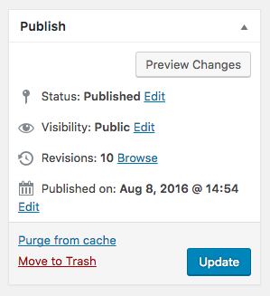

# "CALS Lab" Site Documentation

### General Information:

This site runs Wordpress CMS with the CALS’ “UW-Madison 2015” Theme customized specifically for CALS Lab.

* Site URL: https://calslab.admin.cals.wisc.edu
* Admin URL: https://calslab.admin.cals.wisc.edu/wp-admin/
* Site Administrator: Tom Tabone, tom.tabone@wisc.edu
* CALS IT Contact: Kieran Furey-King, kieran.furey-king@cals.wisc.edu
* CALS IT Web Support: https://websupport.cals.wisc.edu/helpdesk/WebObjects/Helpdesk.woa

### Usage Information Table of Contents:

* How to Log In
* How to Purge the Cache
* How to Update:
	* a Page's Text
	* Lab Hours Widget
	* Header Slideshow
	* a New User's Role
	* Team Member Profile

## How to Log In:
Navigate to https://calslab.admin.cals.wisc.edu/wp-admin/ and use your NetID. If you are a new user, a login will automatically be created for you. You will land on the Dashboard. 

The sidebar on the left provides access to all functions your login has access to. Mousing over the items will bring up a list of related functions. Note: If there are only icons visible in the sidebar, widen your window.

## How to Purge the Cache:

Sometimes you'll make edits to your site, but these changes won't be visible when viewing the site. One common reason is the cache. Brief explanation of why caching is great. 

On the dashboard, or the top toolbar, click **Purge All Varnish Caches**

## How to Update a Page's Text:

Every page of your website can hold text, images, etc. and are all easy to edit. 

In the sidebar, navigate to **Pages > All Pages**

Clicking on a page's title will allow you to edit it. The title is required, and subtitle is up to your discretion. The CALS UW-Madison 2015 Theme provides an Advanced Content Editor, this site utilizes the Normal Wordpress Editor.

The Wordpress Editor works much like a normal word processor. To access more formatting options, click on the rightmost icon.

You can add media (images, video, audio, etc.), add forms, add text, delete text, change formatting, do just about anything. You can always click **Preview Changes** to check out your updates in a new tab. 

*Should there be more information about updating pages? This could link to a page that goes through every single possibility of page editing.*

After updating a page, remember to click the **Update** button in the Publish box.

<em>If you ever update your page and ultimately change your mind, there is a **Revisions** section that saves the updates to your pages. You can use this to switch back to previous versions.

If you want to hide your page from visitors, you can do so by changing the **Status** to **Draft**, or changing the **Visibility** to **Private**. There is a password protected visibility option, too.</em>

## How to Update the Lab Hours Widget:

Every page of the CALS Lab site will display the lab's current hours. This information sits in a custom widget area. 

In the sidebar, navigate to **Appearance > Widgets**

The hours can be edited in the box titled Top Right Hours. The title field can be updated with the current semester.

### Displaying Hours with Text

When displaying text, just write the hours and use line breaks like the image below. The commented-out HTML code (the text between the blue characters) will not be displayed. 

> Content:
> 
>  

\* If there is ever an issue with commenting out code, add an extra opening comment tag at the end. This should fix it:

> Content:
>
>

### Displaying Hours with an Image

To use an image, first upload the image to the media library. In the sidebar, navigate to **Media > Add New**

You can drag the image file onto the page, or click "Select Files" to upload it normally. Next, click 'Edit' or on the image. In the Attachment Details, copy the link in the URL field. (Make sure to get the entire URL)

Now navigate back to **Appearance > Widgets**. 

Move the comment tags around the text, like the image below. And paste the image's URL between the double quotes of **<a href=""** and also ** Content:
> 
> 

The \ tag displays the image, and \<a> tag is a hyperlink, so users can click the image and see it in a new tab.

\* If you have the commenting issue, put an extra opening comment tag right before the closing one. 

## How to Update the Header Slideshow:

The homepage and subpages can display an image or slideshow of images with links. Here’s a better explanation of this, maybe. And suggestions of what "good design" recommends 

In the sidebar, navigate to **Header Slides**.

Click **Add New** or on the title of an existing Header Slide. Slides must have a title, and can have a subtitle if you'd like. You can hide text with the checkbox beneath the title fields. Slides are able to link to specific pages within your site or to external URLs.

You must upload an image in the Hero Image field. Click **Add Image** then select an image from your Media Library or upload a new image.

Below, there are options for the vertical alignment and also filters. You can also include a video instead of an image. Once you have set up the slide, select **Publish** or **Update** on right.

Note: slides are displayed from Newest to Oldest. To reorder the header slideshow, change the publish date. In the list of all header slides, you can use **Quick Edit** option, and set the Date field to a earlier date.

## How to Update a New User’s Role:

For security reasons, new users will not be able to access anything within your site. You will need to update their role.

In the sidebar, navigate to **Users > All Users**

Click on the user you would like to update. In the Name section, there is a dropdown menu for the **Role field**. Select the appropriate role. 

> #### User Role Privileges:
* Subscriber: access to nothing 
* Contributor: can draft posts*, access to Team
* Author: can create/edit posts*, access to Team
* Editor: can create/edit pages and posts*, access to Team
* Administrator: access to everything

\* posts are not used on this site

Note: Remember to click **Update User** at the bottom.

## How to Update a Team Member

This could link to a page specific for CALS Team plugin documentation. It's pretty straight forward. The checkboxes don't do anything at the moment. Fill in the fields. Upload an image using the Featured Image section on the right.
